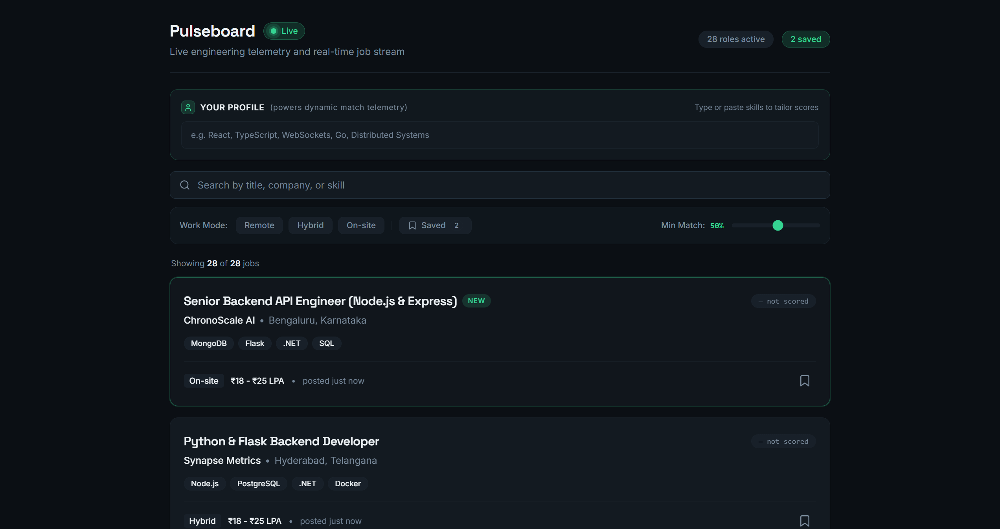
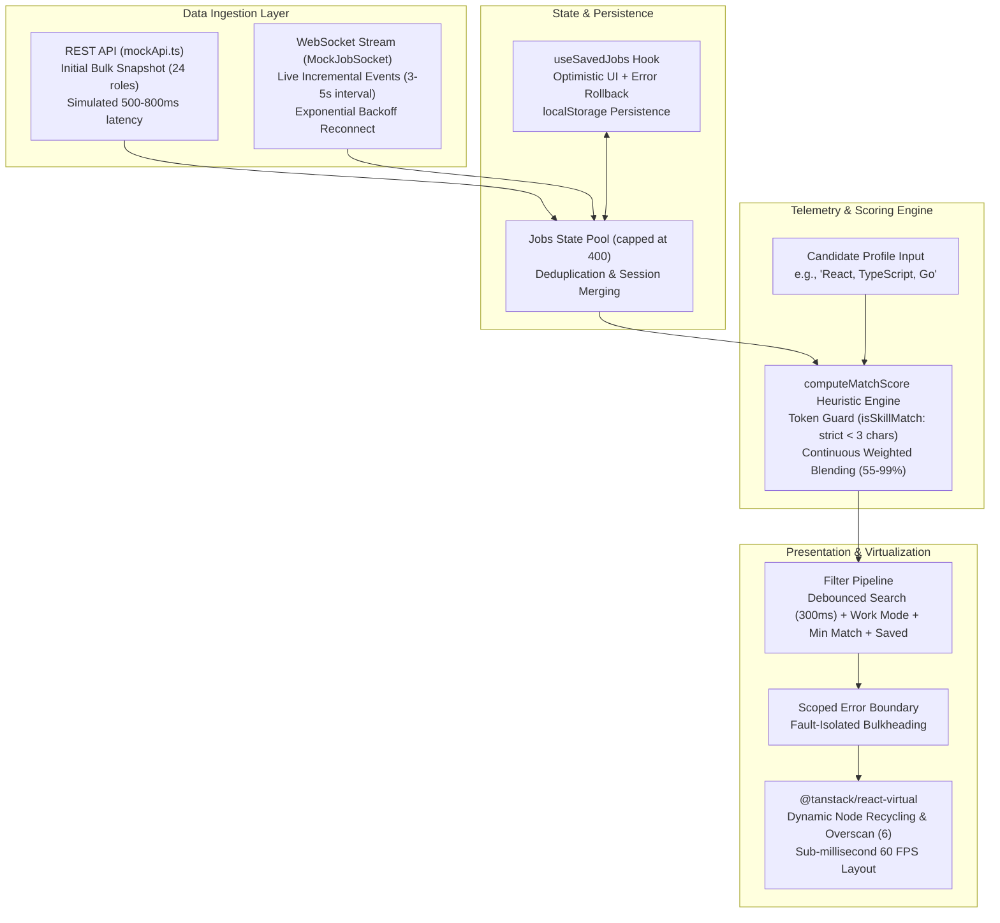

# ⚡ Pulseboard — Real-Time Job Telemetry Dashboard

[](https://pulseboard-mocha.vercel.app/)
[](https://react.dev/)
[](https://www.typescriptlang.org/)
[](https://tailwindcss.com/)
[](https://tanstack.com/virtual/latest)
[](https://vitejs.dev/)


> **Pulseboard** is a high-performance, real-time engineering job telemetry dashboard inspired by high-density developer interfaces (Linear, Datadog, Bloomberg Terminal). It is engineered to solve modern frontend challenges: infinite dynamic data streaming, 60 FPS DOM recycling, resilient WebSocket lifecycle management, optimistic mutations with rollback, and client-side semantic affinity scoring.

<p align="center">
  
</p>

---

## 🌐 Live Deployment

Explore the interactive live application on Vercel:  
👉 **[https://pulseboard-mocha.vercel.app/](https://pulseboard-mocha.vercel.app/)**

---

## 🏗️ Architecture & Data Flow

Pulseboard implements a real-world **hybrid communication model**: an initial bulk state snapshot fetched over REST paired with an incremental, persistent WebSocket stream.



---

## ✨ Key Engineering Highlights

### 1. ⚡ High-Throughput DOM Virtualization (`@tanstack/react-virtual`)
- **Flat Memory Footprint**: Traditional DOM rendering degrades when hundreds of dynamic cards enter the DOM. Pulseboard recycles DOM nodes using TanStack Virtual (`estimateSize: 190`, `overscan: 6`), maintaining rock-solid 60 FPS scrolling whether handling 20 or 400+ jobs.
- **Dynamic Measurement**: Accurately calculates row offsets with zero layout shifts when card heights vary across screen sizes.

### 2. 🔄 Resilient Dual-Protocol Architecture
- **Initial REST Snapshot (`src/mocks/mockApi.ts`)**: Models standard asynchronous REST fetching (`fetchInitialJobs(24)` returning a `Promise<Job[]>`), complete with realistic 500–800ms network latency and ~2% transient HTTP failure simulation with a user-facing retry mechanism.
- **Incremental WebSocket Streaming (`src/hooks/useJobSocket.ts`)**:
  - **Exponential Backoff**: Automatically reconnects upon abnormal disconnections using exponential backoff (`1000 * 2^attempt` ms, capped at 16s).
  - **Stale Closure Mitigation**: Uses a `useRef(onJob)` pattern so unmemoized consumer callbacks never force socket teardowns.
  - **Polymorphic Production Interface**: The socket client strictly satisfies standard `WebSocket` browser contracts (`onopen`, `onmessage`, `onclose`, `onerror`, `close()`), allowing a single-line swap from `new MockJobSocket()` to `new WebSocket(url)` for production deployment.

### 3. 🎯 Candidate Affinity Scoring Engine (`src/utils/matchScore.ts`)
- **Granular Semantic Heuristic**: Simulates continuous cosine-similarity vector scoring by blending candidate profile skills against declared job technology tags with a 60/40 weighted distribution.
- **Substring Collision Guard (`isSkillMatch`)**: Prevents false-positive substring matches on short tokens (< 3 chars). For example, typing `"Go"` or `"AI"` strictly requires exact tag matches, avoiding naive collisions inside `"Algorithms"` or `"Tailwind CSS"`.
- **Honest Telemetry**:
  - Unscored state displays a muted, dashed `— not scored` badge before profile input.
  - Dynamically calculates match percentages only after candidate skills are provided.
  - Transparently partitions input into **"Matched skills"** vs. **"No match found for:"** chips.

### 4. 💾 Optimistic Mutations with Rollback & Persistence (`src/hooks/useSavedJobs.ts`)
- **0ms UI Feedback**: Bookmarking a job updates UI state immediately.
- **Automated Failure Rollback**: Simulates network mutations (350–750ms) with occasional failure chaos (~4% rate). On failure, snapshots are automatically restored.
- **Cross-Session Storage**: Persists full `Job` records to `localStorage` (`pulseboard:savedJobs`) and re-injects saved jobs on initial load, ensuring saved bookmarks persist even when mock session IDs regenerate.

### 5. 🛡️ Scoped Fault Isolation (`src/components/ErrorBoundary.tsx`)
- Scoped strictly around `<JobFeed>`, preventing anomalous card payloads or virtualizer layout throws from crashing top-level navigation, search, or status pills.

---

## 🔀 Branch Strategy & Versions

This project demonstrates two architectural flavors:

| Branch | Description | Dependency Scope |
| :--- | :--- | :--- |
| **`main` (Version 1)** | Fully self-contained, offline-first engineering portfolio build. Employs simulated REST (`mockApi.ts`) and simulated WebSocket (`MockJobSocket`) layers. | **Zero external dependencies** — guaranteed to demo anywhere, anytime without network flakes. |
| **`feature/real-rest-api` (Version 2)** | Replaces the mock REST generator with a live integration to the public, CORS-enabled **Arbeitnow Job Board REST API**. | Connects across the public Internet to fetch live real-world engineering roles. |

---

## 🛠️ Tech Stack & Decisions

| Technology | Purpose | Key Rationale |
| :--- | :--- | :--- |
| **React 19** | UI Library | Modern hooks, functional state, and fine-grained reactivity. |
| **TypeScript 6** | Language | Full type safety across job schemas, WebSocket message events, and component props. |
| **Tailwind CSS v4** | Styling Engine | CSS-first configuration via `@theme`, high-density dark-mode telemetry palette (`#0B0F14`). |
| **@tanstack/react-virtual** | Virtualization | Headless virtual scrolling ensuring predictable memory usage for live streams. |
| **Vite 8** | Build Tooling | Lightning-fast HMR and optimized production bundling (< 86 kB gzipped JS). |
| **Oxlint** | Linter | High-performance Rust-based JavaScript/TypeScript linting. |

---

## 📂 Project Structure

```
pulseboard/
├── public/                     # Static public assets (favicon.svg, icons.svg)
├── src/
│   ├── assets/                 # SVGs and static visual assets
│   ├── components/             # Domain UI components
│   │   ├── ui/                 # Reusable atomic design system (Badge, Card, Button, Input, Skeleton)
│   │   ├── ConnectionStatus.tsx# Dual-ring pulsing radar heartbeat indicator
│   │   ├── ErrorBoundary.tsx   # React class error boundary for bulkheaded fault recovery
│   │   ├── FilterPanel.tsx     # WorkMode chips, Saved filter toggle, Min Match range slider
│   │   ├── JobCard.tsx         # High-density job card with dynamic badges & relative time
│   │   ├── JobFeed.tsx         # Virtualized scroll list with empty, loading, & error states
│   │   └── SearchBar.tsx       # Instant search input with debounced querying
│   ├── hooks/                  # Custom React hooks
│   │   ├── useDebounce.ts      # Debounces search input (300ms)
│   │   ├── useJobSocket.ts     # WebSocket lifecycle, reconnect backoff, & message ingestion
│   │   └── useSavedJobs.ts     # Optimistic bookmarking with automated rollback & localStorage
│   ├── mocks/                  # Telemetry simulation engines
│   │   ├── jobData.ts          # Comprehensive technology tags pool & job generator
│   │   ├── mockApi.ts          # Simulated asynchronous REST GET endpoint with latency/errors
│   │   └── mockServer.ts       # Browser-compatible simulated WebSocket server
│   ├── types/
│   │   └── job.ts              # Core TypeScript domain models (Job, WorkMode, ConnectionState)
│   ├── utils/
│   │   └── matchScore.ts       # Semantic match scoring & short-token collision guard
│   ├── App.tsx                 # Root application composition & state coordinator
│   ├── index.css               # Design system tokens, keyframe animations, & Tailwind theme
│   └── main.tsx                # Client entry point
├── index.html                  # HTML5 shell with preloaded typography (Space Grotesk, Inter)
├── package.json                # Dependencies, scripts, and package metadata
├── tsconfig.json               # TypeScript compiler configuration
└── vite.config.ts              # Vite & Tailwind CSS v4 build configuration
```

---

## 🚀 Getting Started

### Prerequisites
- **Node.js** `>= 18.0.0`
- **npm** `>= 9.0.0`

### Installation

1. Clone the repository:
   ```bash
   git clone https://github.com/darshna21-bit/pulseboard.git
   cd pulseboard
   ```

2. Install dependencies:
   ```bash
   npm install
   ```

3. Start the local development server:
   ```bash
   npm run dev
   ```
   Open [http://localhost:5173](http://localhost:5173) in your browser.

### Available Scripts

| Command | Description |
| :--- | :--- |
| `npm run dev` | Starts Vite development server with Hot Module Replacement (HMR). |
| `npm run build` | Compiles TypeScript (`tsc -b`) and bundles production assets with Vite. |
| `npm run lint` | Runs Oxlint across all TypeScript and React files. |
| `npm run preview` | Locally serves the production build from `dist/` directory. |

---

## 📄 License

This project is open source and available under the **MIT License**.

---

**Crafted by [Darshna](https://github.com/darshna21-bit)** — Frontend Engineer.
